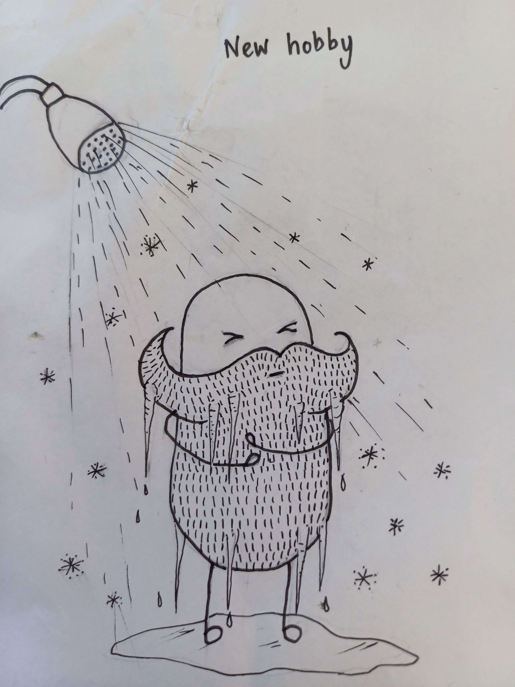

import { Image } from 'astro:assets';
import coldShower from "../images/cold_shower_new_hobby.jpg"; // Image is 1600x900
export const tags = ["pico8", "learning"];

**use the arrow and X keys to play**

## How to Play

To play, select the seeker with the arrow keys and press X.
The idea is to look around our pixelated living room, and look for the hidden players.
You start with 10 'looks'. move around the living room pressing the look button (X) where you think 
the players might be hiding, if you find a player, then you get two more looks
I you find everyone with looks remaining; congratulations! press X to play again

Hours of fun for the whole family. Guaranteed or your money back.

## Motivations

My girls Arla and Phoebe love playing hide n seek in our shoebox of a house.
Not my favourite game to be honest. There is only so many hiding places in our house I can squeeze my fat arse into.
But the girls love it, so they may nag me into a game or two on a Sunday morning.

I want to get into making games this year Pico 8 seemed like a great place to start, and thought that making simple games with the girls in them
would be a good place to start.
The girls get a real kick out seeing pixelated versions of themselves, and our living room in this game.
Having pixilated versions of little daddy and little mummy is delightful for them.
Watching them play it and laughing makes me feel all warm and fuzzy inside.

## Little mummy and little daddy?

Before the girls came along, Celestina used to make these occasional comic, usually to mock and of my hobbies of the week. And the tradition has kind of stuck by making each other cards for birthdays and the like.

For a while there Arla's imaginary friends where little mummy and little daddy, which I suppose is a tad red flagy without context.

## Pico 8 you say?

Yeah, great place to start. It's great because it's so constrained. 
I think I would recommend getting good at it, learning some 2d game physics and making a few experiments before getting into something more full featured, like Godat or Bevy.
At least, that's what I plan to do. 
[here's a great place to start](https://www.reddit.com/r/pico8/comments/zz79bw/pico8_101_intro_resources_list/)

## Isn't this game a bit shit?

Look, yes it is. But it's all part of the plan. This year I intend to do many small projects of variable quality in my limited free time. (when I have not given in to the allure of watching Youtube vids and/or doom scrolling).
So the plan is to learn much more Maths through making small games. as well as learning Rust as a side quest 
Wish me luck.
[source code here](https://github.com/sasky/pico8/tree/main/hideNseek)